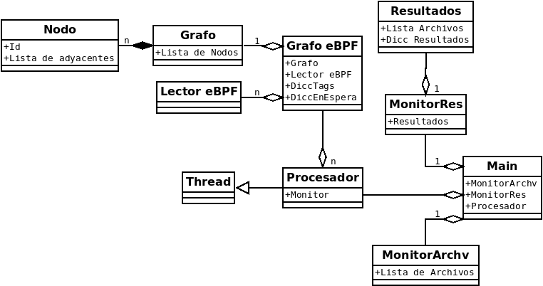

# TP2

## Nombre y Apellido: Axel Aparicio Rotermund
## Padron: 96283
## Link Github: https://github.com/axlrott/TP2-2C-2020.git

### Introduccion:

### Grafo y Nodos:

#### Nodos:

Los **Nodos** van a ser clases que son contenidas por un **Grafo**, las mismas van a tener un entero que va a representar un id del mismo y van a tener una lista de los nodos que son adyacentes a el.

#### Grafo: 

El **Grafo** va a ser una clase la cual va a representar un grafo, se le va a poder agregar nodos pasandoles el id que se quiera que tenga cada nodo, se van a poder crear adyacencias especificando entre los ids que uno quiera que haya la adyacencia, tambien se va a poder llamar a una busqueda DFS la cual va a hacer una busqueda en profundidad en el grafo y va a devolver un enumerado que va a ser 1 en caso de que haya ciclos, 2 en caso de que haya instrucciones sin uso y 0 en caso de que no haya ninguno de los dos.

### Lector eBPF:

La clase **Lector eBPF** va a servir para leer una linea en string que representa una linea de un archivo ".bpf" y va a decodificarla para poder decir si tiene saltos, o si ese salto es incondicional, y los argumentos que tiene ese salto, si la linea tiene alguna etiqueta, en ese caso tambien se puede pedir la etiqueta que tiene, o tambien si la linea es un return.

### Grafo eBPF:

El **Grafo eBPF** va a recibir un string el cual es el nombre del archivo ".bpf" al cual crearle el grafo, esta clase va a contener una clase **Grafo** y una **Lector eBPF**, el cual usara para leer linea por linea el archivo especificado e ira creando el grafo en base a eso.

### Archivos:

Esta clase va a servir para almacenar string que representan archivos y tambien para pedir archivos de esa lista, en caso de que la lista este vacia se devolvera un string vacio.

### Resultados:

La clase **Resultados** sirve para almacenar resultados de un archivo, en el caso de esta clase se le pasara el nombre del archivo y dos boolean que representaran el primero si hubo ciclos y el segundo si hubo instrucciones sin uso. Esta clase esta hecha para ser usada luego de haber pasado un archivo ".bpf" por la clase **Grafo eBPF** y volcar sus resultados en esta clase, cada archivo que sea ingresado se almacenara alfabeticamente y se podra pedir mediante una funcion la muestra de todos los resultados de los archivos pasados por salida estandar.

### Thread y Lock:

La clase Thread va a servir mas que nada para ser la clase padre de la clase procesador y asi poder utilizar Threads por herencia.
La clase Lock va a ser creado para poder utilizar mutex en las funciones que sea necesario y es utilizada por la clase Monitor Archivos

### Monitor Archivos:

Esta clase va a servir para ser el monitor de la clase **Archivos** y **Resultados**, cada vez que se reciba archivos de la clase **Archivos** o se manden resultados de archivos a la clase **Resultados** este utiliza un Lock para cuidar que cada thread lo haga de a uno a la vez para que no haya conflicots

### Procesador:

Procesador va a ser una clase que hereda de **Thread** y esta hecha para que se corran los threads ahi. La misma va a utilizar un monitor para recibir el nombre de los archivos de la clase **Archivos**, va a crear la clase **Grafo eBPF** con ese archivo y luego va a volvar los resultados mediante el monitor a la clase **Resultados**

### Main:

El main va a tomar los parametros pasados, como la cantidad de threads a usar y los archivos BPF que se quieren verificar. Se van a crear Clases de **Archivos** y **Resultados**, a la clase **Archivos** se le iran pasando todos los archivos recibidos, luego se creara un **Monitor** con las clases **Archivos** y **Resultados** para luego ir creando los threads pedidos en la clase **Procesar** pasandoles el respectivo monitor como parametro, luego se hara join de todos los threads y terminado todo se pedira a la clase **Resultados** creada que muestre todos los resultados de los archivos.

